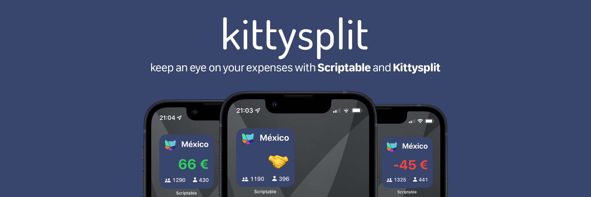

# Kittysplit for Scriptable

## What's this?

[Kittysplit](https://kittysplit.com/) is an expense splitting tool for groups. It offers easy splitting of group expenses e.g. on holiday trips. Kittysplit does not require any registration and has no native app but a great web app that works great! The only downside to this is that it's missing some features that a native app could provide. This [Scriptable](https://scriptable.app) widget aims to solve this problem by providing a neat home screen widget for any kitty!

It shows you the amount of money you owe or are owed in addition to the total cost of the event as well as your individual costs. You see shaking hands if you do not owe or are owed anything 🤝

## Instructions

1. Download and extract `kittysplit.js` into the Scriptable folder located in your iCloud Drive.
2. Launch Scriptable and make sure that `kittysplit` is listed in the scripts view.
3. Configure your the kitty URL and the username to track at the top of the script.
5. Once everything is configured, run the script and verify that everything is working correctly.
6. Go back to your home screen and add a **small** Scriptable widget.
7. Edit the Scriptable widget and choose `kittysplit` as the script.

## Known Issues
* Right now the widget only supports the small widget size. A medium and large sized version may follow in the future

## About this project

The script is authored by [@thartwi](https://twitter.com/thartwi) (me) on an ongoing quest to create useful and pretty home screen pages. I regularly use Kittysplit to split expenses on trips with my friends and each time I would love to have a way to quickly glance at the current expenses. Since Kittysplit can't provide a widget this script is here to save the day! 🚀

## Thanks 🙏
Thanks to [@simonbs](https://twitter.com/simonbs) for making an awesome app!\
Thanks to [@kittysplit](https://twitter.com/kittysplit) for making an awesome expense splitting tool!